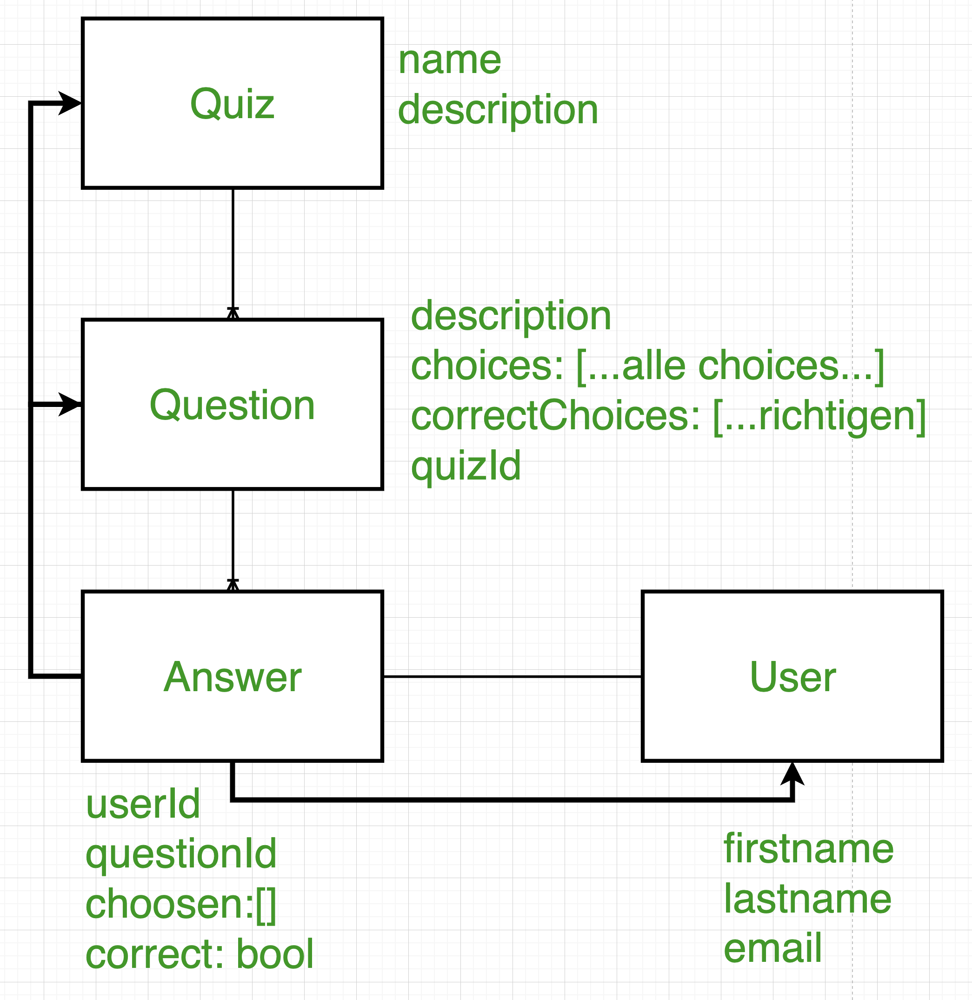
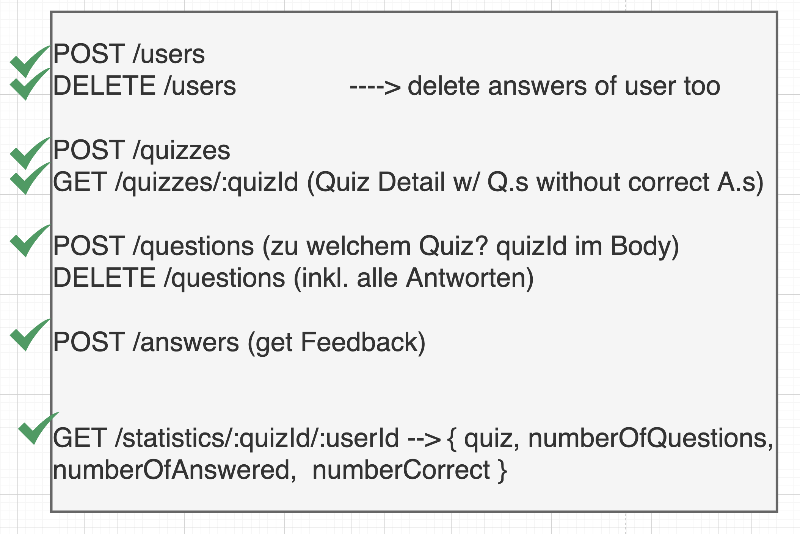

# API für eine Multiple Choice Quiz-App quizzio

Die App erlaubt Nutzer mehrere multiple choice Quiz (zB als Ratespiel, oder Test) anzulegen

**Entitäten: User, Quiz, Question, Answer**

- Ein Quiz besteht aus mehreren Fragen die aus Gründen der späteren Weiterverarbeitung in einer separaten Collection gespeichert werden

- Fragen haben eine Beschreibung/Fragenformulierung, sowie mindestens zwei verschiedene Antwortmöglichkeiten von denen mindestens eine richtig sein muss (Hinweis es können auch alle Antwortmöglichkeiten richtig sein)

- Für bestehende Quiz-Fragen können Antworten von unterschiedlichen Benutzern hinzugefügt werden und es wird ein Feedback zur Antwort geliefert (zB richtig %, falsch %)

- Beim Beantworten einer Frage muss eine ID von der User-Entität übergeben werden (User müssen daher ebenso durch CRUD routes verwaltet werden können: User haben einen Vornamen, Nachnamen, eine E-Mail und eine \_id )

- Wird ein User oder eine Frage gelöscht, dann werden auch die dazu gehörenden Antworten gelöscht

Aufgabe: Überlege dir welche Endpunkte für eine Client-App sinnvoll sind und setze diese um. (Für einen Denkanstoß fange mit CRUD routes für jede Entität an.)

Hinweis: Achte darauf das beim Lesen von Fragen die richtigen Antworten nicht von der API preisgegeben werden!

Hinweis: Achte ebenso darauf, dass der gleiche Nutzer eine Frage nur einmal beantworten darf!

Bonus-Aufgabe: Schreibe einen „Statistik“-Endpunkt der eine Zusammenfassung der Antworten (zb Punktestand) für ein Quiz und einem Nutzer liefert. Entscheide selbst wie die Punktevergabe funktionieren soll.

## Umsetzung

